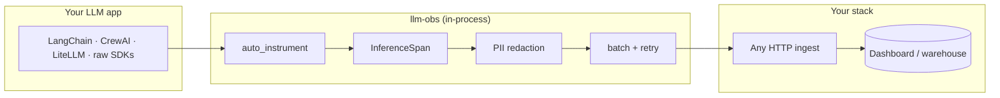

# llm-obs

**Flight recorder for LLM apps** — local-first inference tracing with PII redaction before anything leaves your process.

[](https://pypi.org/project/llm-obs/)
[](LICENSE)
[](https://pypi.org/project/llm-obs/)

> One line instruments OpenAI, Anthropic, Gemini, and Bedrock. Ship traces, token usage, latency, and failures to **any** HTTP ingest API — no vendor lock-in.

<p align="center">
  <strong>Demo GIF</strong> — add <code>docs/assets/demo.gif</code> (~20s: <code>auto_instrument()</code> → one chat → ingest log).<br />
  <a href="docs/assets/README.md">Recording guide</a> · placeholder below until you upload
</p>

<!-- Uncomment when demo.gif exists:
<p align="center">
  
</p>
-->

---

## Why this exists

LLM apps fail in ways traditional APM misses: silent prompt regressions, runaway token cost, PII leaking into logs, and “slow” that is really time-to-first-token.

**llm-obs** is a lightweight Python SDK that:

- Records **every inference** as a structured span (provider, model, tokens, cost, latency, TTFT, status).
- **Redacts PII in-process** before HTTP export.
- **Batches asynchronously** so your hot path stays fast.
- Stays **vendor-neutral** — your ingest endpoint, your dashboard, your data residency.

Think **OpenTelemetry-native AI tracing** in spirit (span model today; OTLP export on the [roadmap](#roadmap)). Not another hosted “AI observability platform” you have to buy to get value.

---

## Quickstart (< 2 minutes)

```bash
pip install "llm-obs[openai]"
export OPENAI_API_KEY=sk-...
export INGEST_URL=http://localhost:4000   # any compatible ingest API
export INGEST_API_KEY=dev-key             # optional
```

```python
from llm_obs import ObservabilityClient

obs = ObservabilityClient()   # reads INGEST_URL / INGEST_API_KEY from env
obs.auto_instrument()         # patches installed LLM SDKs — one time at startup

# existing code unchanged; every completion is now traced
```

```python
# asyncio + openai example — see examples/openai_basic.py
import asyncio
from openai import AsyncOpenAI

async def main():
    client = AsyncOpenAI()
    r = await client.chat.completions.create(
        model="gpt-4o-mini",
        messages=[{"role": "user", "content": "Hello"}],
    )
    print(r.choices[0].message.content)

asyncio.run(main())
```

Flush on shutdown: `obs.flush()` (or rely on batch timer).

---

## Killer visual — one inference, four signals

What lands in your ingest / dashboard per call:

```
┌─────────────────────────────────────────────────────────────────────────────┐
│  TRACE 01J8K9M2N3P4Q5R6S7T8U9V0W   conversation_id: support-ticket-8842     │
├─────────────────────────────────────────────────────────────────────────────┤
│  provider: openai          model: gpt-4o-mini          status: ● success    │
│  latency: 1,240 ms         TTFT: 210 ms (stream)       cost: $0.00042      │
├─────────────────────────────────────────────────────────────────────────────┤
│  TOKENS   prompt: 842  completion: 118  total: 960                          │
├─────────────────────────────────────────────────────────────────────────────┤
│  REQUEST (PII redacted)          │  RESPONSE (truncated)                    │
│  user: [EMAIL_REDACTED] …        │  "Here are three options…"             │
├─────────────────────────────────────────────────────────────────────────────┤
│  FAILURES (when status=error)    │  rate_limit · context_length · timeout  │
└─────────────────────────────────────────────────────────────────────────────┘
```

Add real screenshots under `docs/assets/` (`dashboard-traces.png`, etc.) — see [docs/assets/README.md](docs/assets/README.md).

---

## Architecture



Source: [docs/assets/architecture.mmd](docs/assets/architecture.mmd)

---

## Features

| Feature | Description |
|---------|-------------|
| **Auto-instrument** | Monkey-patch OpenAI, Anthropic, Gemini, Bedrock at startup |
| **Unified streaming** | `stream_chat()` across providers + Ollama-compatible URLs |
| **Inference spans** | Latency, TTFT, tokens, USD cost, status, errors |
| **PII redaction** | Email, phone, SSN, cards (Luhn), API keys, IPv4, URL secrets — before HTTP |
| **Batch transport** | Configurable batch size + flush interval; non-blocking enqueue |
| **Context linking** | `set_obs_context(conversation_id=…, session_id=…)` |
| **Endpoint discovery** | Probe Ollama, vLLM, LiteLLM proxy URLs via `LLM_ENDPOINTS` |
| **Vendor-neutral** | Works with self-hosted ingest; no required SaaS |

---

## Supported frameworks & providers

### Providers (first-class patches)

| Provider | Install extra | Auto-instrument target |
|----------|---------------|-------------------------|
| OpenAI | `llm-obs[openai]` | `AsyncOpenAI` completions |
| Anthropic | `llm-obs[anthropic]` | `AsyncAnthropic` messages |
| Google Gemini | `llm-obs[gemini]` | `GenerativeModel` async |
| AWS Bedrock | `llm-obs[bedrock]` | `bedrock-runtime` invoke + stream |
| Ollama / vLLM / LiteLLM proxy | `llm-obs[openai]` or core | OpenAI-compatible `/v1` URLs |

### Frameworks (via underlying SDKs)

| Framework | Status | How |
|-----------|--------|-----|
| **LangChain** | Works today | `auto_instrument()` before `ChatOpenAI` / Anthropic chat models |
| **LiteLLM** | Works today | Patches OpenAI path; see [examples/litellm_basic.py](examples/litellm_basic.py) |
| **CrewAI** | Works today | Instrument at startup before crew runs |
| **LlamaIndex** | Roadmap | Dedicated callback handler |
| **Vercel AI SDK** | Roadmap | Node SDK / separate package |

Examples: [`examples/`](examples/)

---

## Benchmarks

Local overhead (no network, noop transport) — run yourself:

```bash
python examples/benchmark_overhead.py
```

| Metric | Typical (dev machine) | Notes |
|--------|----------------------|--------|
| Span create + end (p50) | ~0.06 ms | Per inference, in-process |
| Span create + end (p99) | ~0.08 ms | |
| PII redact (per string) | ~0.02 ms | Depends on payload size |
| Batch enqueue | ~µs | Hot path; flush is background thread |
| Memory (SDK + benchmark) | ~7 MiB traced peak | Excludes LLM SDK heaps |

End-to-end latency overhead on real calls is usually **sub-millisecond** vs multi-second LLM RTT. Re-run benchmarks after upgrades and publish results in release notes.

---

## Install

```bash
pip install llm-obs
pip install "llm-obs[all]"    # all provider extras
```

| Extra | Packages |
|-------|----------|
| `openai` | openai |
| `anthropic` | anthropic |
| `gemini` | google-generativeai |
| `bedrock` | boto3 |

---

## Examples

| Example | Command |
|---------|---------|
| OpenAI | `python examples/openai_basic.py` |
| LangChain | `python examples/langchain_basic.py` |
| CrewAI | `python examples/crewai_basic.py` |
| LiteLLM | `python examples/litellm_basic.py` |

---

## Configuration

| Env var | Default | Purpose |
|---------|---------|---------|
| `INGEST_URL` | `http://localhost:4000` | Ingest API base URL |
| `INGEST_API_KEY` | — | `x-obs-api-key` header |
| `ENVIRONMENT` | `dev` | Tagged on every span |
| `LLM_ENDPOINTS` | — | Comma-separated URLs to probe (Ollama, vLLM, …) |

```python
obs = ObservabilityClient(
    endpoint="https://ingest.example.com",
    api_key="secret",
    redact_pii=True,          # default
    batch_size=20,
    flush_interval_s=2.0,
)
```

---

## Manual spans

```python
span = obs.start_span(
    provider="openai",
    model="gpt-4o-mini",
    request={"messages": [{"role": "user", "content": "Hello"}]},
    conversation_id="conv-123",
)
span.set_ttft(ms=210)
span.set_usage(prompt_tokens=42, completion_tokens=11)
span.end(status="success", streamed=True)
```

---

## Roadmap

**Integrations (in-repo examples first; separate demo repos later):**

- [x] LangChain — example in `examples/`
- [x] LiteLLM — example in `examples/`
- [x] CrewAI — example in `examples/`
- [ ] LlamaIndex callback handler
- [ ] Vercel AI SDK (TypeScript package or bridge)
- [ ] OpenTelemetry OTLP exporter (span → OTel proto)
- [ ] First-class Hugging Face / TGI

**Docs & media:**

- [ ] `docs/assets/demo.gif` (20s)
- [ ] Dashboard screenshot set (traces · tokens · latency · failures)

---

## Related projects

| Project | What it is |
|---------|------------|
| **This repo (`llm-obs`)** | Open-source Python SDK (MIT) — **you are here** |
| **[llm-observability](https://github.com/repanareddysekhar/llm-observability)** | Optional full stack: ingest API, worker, dashboard |

---

## Contributing

See [CONTRIBUTING.md](CONTRIBUTING.md). Security: [SECURITY.md](SECURITY.md).

---

## License

MIT — see [LICENSE](LICENSE).
